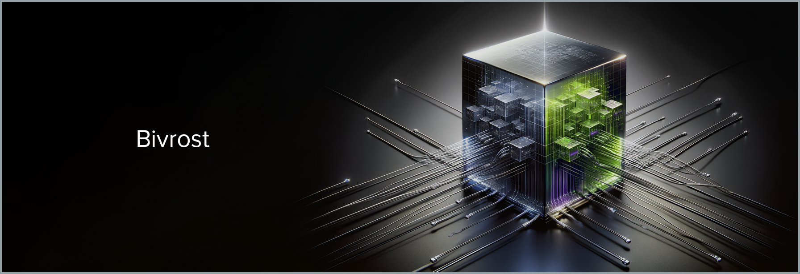

# Bivrost / Bifrost

> In Norse mythology, Bifröst (/ˈbɪvrɒst/ [ⓘ] [[1]]), also called Bilröst, is a burning rainbow bridge that reaches between Midgard (Earth) and Asgard, the realm of the gods.
> [Wikipedia](https://en.wikipedia.org/wiki/Bifröst)

[1]: https://www.collinsdictionary.com/dictionary/english/bifrost?showCookiePolicy=true
[ⓘ]: https://en.wikipedia.org/wiki/File:Bifrost.ogg

---

## Overview

Bivrost is a simple, (hopefully) fast, and (hopefully) reliable adapter and bridge between different services. It's designed to be modular and easy to extend, and to be able to handle a wide variety of different services and protocols.

Bivrost is written in Go due to it being a statically typed, memory safe, and compiled language designed for networking and concurrency.

## Features

- **Self-contained**: Bivrost is a single binary with no dependencies.
- **Modular**: Bivrost is designed to be easy to extend and add new services and protocols.
- **Fast**: Bivrost is designed to be fast and efficient.
- **Reliable**: Bivrost is designed to be reliable and to handle a wide variety of different services and protocols.
